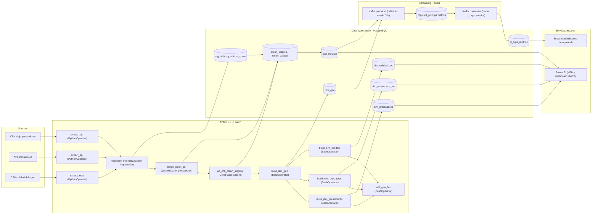
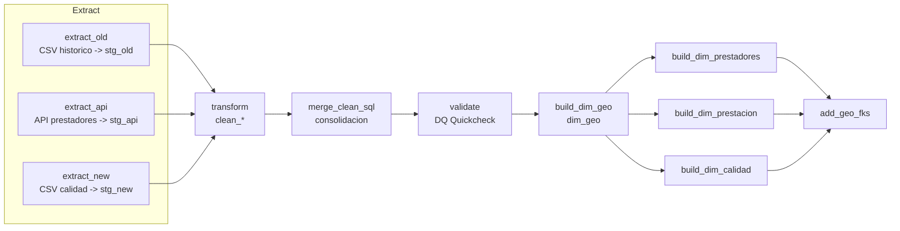
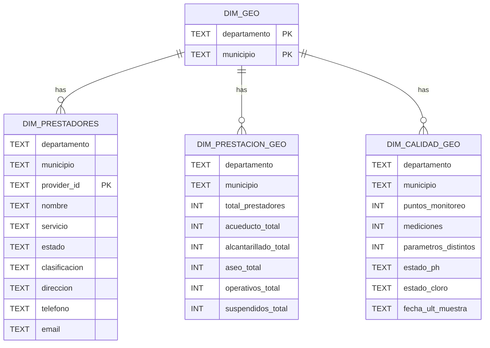

# ETLProject_FinalDelivery🚰


**Entrega Final · Orquestación con Apache Airflow · Modelo Dimensional (Snowflake) · Great Expectations**
**Stack:** Python · PostgreSQL · Docker/Compose · Apache Airflow · Power BI· Kafka

**Equipo:**
Esteban Cobo · Jose David Mesa · Carlos Andrés Orozco · Sara Lucía Rojas

---

## Objetivos del Proyecto (ODS 6 – Agua limpia y saneamiento)

Desarrollar un **pipeline ETL robusto, monitoreado y en tiempo parcial real** para consolidar y democratizar la información oficial sobre la **calidad del agua potable y la prestación del servicio** en Colombia, contribuyendo al cumplimiento del **ODS 6** de Naciones Unidas.

### Objetivos específicos
- Integrar y unificar tres fuentes oficiales colombianas:
  - Registro Único de Prestadores de Servicios Públicos (histórico)
  - API en tiempo real del Sistema Único de Información (SUI – SuperServicios)
  - Reportes de calidad del agua (Índice de Riesgo de la Calidad del Agua – IRCA) del INS
- Generar un **data warehouse en esquema Snowflake** con dimensiones conformes y hechos de calidad del agua a nivel municipal
- Garantizar la **calidad de los datos** mediante Great Expectations (reglas críticas detienen el pipeline)
- Orquestar todo el proceso con **Apache Airflow** (DAG idempotente y con alertas)
- Implementar **streaming de métricas clave** vía Kafka para monitoreo en tiempo real
- Exponer un modelo analítico listo para:
  - Dashboards públicos/privados en Power BI
  - Análisis de brechas en cobertura y calidad del servicio por departamento y municipio
  - Identificación de zonas de riesgo sanitario (IRCA alto) y prestadores con problemas recurrentes

**Impacto esperado:**  
Facilitar a entidades reguladoras, academia y ciudadanía el acceso a datos confiables y actualizados sobre el estado del servicio de agua potable en Colombia, apoyando la toma de decisiones para cerrar brechas y garantizar el derecho humano al agua (meta 6.1 del ODS 6).
---

| Tecnología                     | Descripción                                                                                           |
|-------------------------------|-------------------------------------------------------------------------------------------------------|
| Python 3.11+                  | Core del ETL, consumidores Kafka y toda la lógica de transformación                                 |
| PostgreSQL 15                 | Data warehouse en esquema Snowflake: staging → clean → dimensiones + hechos                        |
| Great Expectations            | Suite de calidad con reglas bloqueantes y de aviso (integrada en el DAG)                            |
| Apache Airflow                | Orquestación completa del pipeline (DAG idempotente + reintentos + alertas)                         |
| Docker + Docker Compose       | Entorno totalmente reproducible: Airflow + Postgres + Kafka + Streamlit                            |
| Apache Kafka                  | Streaming de métricas de calidad del agua y alertas en tiempo real                                  |
| Streamlit                     | Dashboard interactivo en tiempo real (mapas, IRCA por municipio, alertas)                           |
| Power BI                      | Dashboard analítico oficial conectado al modelo Snowflake (KPIs nacionales y departamentales)      |
| pandas + geopandas            | Limpieza, enriquecimiento geográfico y validación de coordenadas de Colombia                        |
| Git & GitHub                  | Control de versiones y repositorio público de la entrega final                                      |
| Makefile + bash               | Automatización del entorno local (docker-up, reset, test, run-all)                                  |

## Stack resumido (una línea épica para diapositivas)

```markdown
Python → PostgreSQL + Great Expectations → Airflow → Kafka → Streamlit + Power BI
```
## 🧭 Arquitectura de Alto Nivel

> Diagrama renderizable en GitHub (Mermaid):




---

## 🗂️ Datasets Incluidos

### 1) `stg_old` — CSV histórico de prestadores

* **Campos:** `nit`, `nombre`, `departamento_prestacion`, `municipio_prestacion`, `servicio`, `estado`, `clasificacion`, `direccion`, `telefono`, `email`.
* **Rol:** Base de prestadores + contacto/dirección (solo aquí existe contacto).

### 2) `stg_api` — API de prestadores

* **Campos:** `nombre`, `departamento_prestacion`, `municipio_prestacion`, `servicio`, `estado`, `clasificacion`.
* **Rol:** Complementa universo de prestadores/servicios. (Sin contacto).

### 3) `stg_new` — CSV de calidad del agua

* **Campos:** `departamento`, `municipio`, `fecha`, `propiedad_observada` (parámetro), `resultado`, `unidad_del_resultado`, `nombre_del_punto_de_monitoreo`, `latitud`, `longitud`.
* **Rol:** Series de calidad con coordenadas por **punto** y **fecha**.

---

## 🔁 DAG (Airflow)



**Orden de tareas:**
`extract_* → transform → merge_clean_sql → validate → build_dim_geo → build_dim_* → add_geo_fks`

---

## 🧪 Proceso ETL (detallado)

### 1) **Extract** (llevar fuentes a **staging** sin lógica de negocio)

* `extract_old`: CSV → `stg_old` (cast seguro a texto/número/fecha).
* `extract_api`: API → `stg_api` (esquema homogéneo con `stg_old`).
* `extract_new`: CSV → `stg_new` (sin limpiar semántica aún).

> **Buenas prácticas Airflow:** cada fuente en su Task, dependencias claras hacia `transform`.

---

### 2) **Transform** (construcción de **clean_***)

#### 2.1 Prestadores → `clean_staging`

* **Normalización:** `UPPER + TRIM + quitar tildes` en nombres y ubicaciones.
* **Llave técnica (`provider_id`)**: `COALESCE(nit, md5(UPPER(nombre)|dep|mun|servicio))`.
* **Servicio (catálogo):** `ACUEDUCTO / ALCANTARILLADO / ASEO`; si no mapea → `DESCONOCIDO` (para no perder filas).
* **Estado:** `OPERATIVA / SUSPENDIDA / OTRO`; **imputación por moda** `(servicio, departamento)` si falta.
* **Contacto** (`direccion/telefono/email`): se **preserva** desde `stg_old`.
* **Dominio geográfico:** `departamento` validado contra catálogo oficial del proyecto.
* **Deduplicación:** por `(provider_id, servicio, departamento, municipio)` (estrategia `ROW_NUMBER/ctid`).

**Salida:**
`clean_staging(provider_id, nombre, departamento, municipio, servicio, estado, clasificacion, direccion, telefono, email)`

#### 2.2 Calidad → `clean_calidad`

* **Fecha:** parse robusto a `DATE` (`fecha_muestra`).
* **Valor:** limpieza de símbolos + cast a `double precision`.
* **Coordenadas (COL):** lat∈`[-5, 15]`, lon∈`[-82, -66]`; si falta una → ambas `NULL`.
* **Plausibilidad:**

  * `pH` en `[0,14]` (fuera → `NULL` para imputar).
  * `Cloro` 0–5 mg/L (fuera → `NULL` para imputar).
* **Imputación:** `unidad` = **moda por parámetro**; `valor` = **mediana por (parámetro, departamento)** → fallback **mediana global**.
* **Unicidad:** `(departamento, municipio, parametro, fecha_muestra, COALESCE(nombre_punto,''))`.

**Salida:**
`clean_calidad(departamento, municipio, parametro, valor, fecha_muestra, unidad, nombre_punto, latitud, longitud)`

---

### 3) **Merge** (consolidación final de prestadores)

**¿Qué une y cómo?**

* **Fuentes:** `stg_old` + `stg_api` (ya normalizadas por `transform`).
* **Llave de dedupe:** `(provider_id, servicio, departamento, municipio)`.
* **Contacto:** se **toma desde `stg_old`** (si existe) para **direccion/telefono/email**.
* **Resultado:** `clean_staging` listo para dimensiones.

**Texto corto para diapositiva (merge):**
*Se consolidaron prestadores de CSV y API usando `provider_id` (NIT o hash de nombre/dep/mun/servicio). Se normalizaron servicios, se deduplicó por `(provider_id, servicio, departamento, municipio)` y se preservó contacto desde histórico.*

---

### 4) **Dimensiones** (modelo **Snowflake**)




* `dim_geo(departamento, municipio)` **central**.
* `dim_prestadores(departamento, municipio, provider_id, …)`
* `dim_prestacion_geo(departamento, municipio, agregados)`
* `dim_calidad_geo(departamento, municipio, agregados calidad)`
* FKs `(NOT VALID + VALIDATE)` para no bloquear cargas y luego **validar**.

> Este **snowflake** permite compartir **geo** entre dominios y facilita agregar **hechos** en el futuro (drill-across).

---

---
## 🧪 Validación con Great Expectations

**Expectations bloqueantes (fallan el DAG si no pasan):**

- Claves primarias y foráneas → **not null** y **unique**
- Llaves lógicas sin **duplicados**
- Fechas de muestreo dentro del rango permitido
- Coordenadas **lat/lon dentro del territorio colombiano** y correctamente pareadas
- Valores de **pH** y **cloro residual** dentro de rangos fisiológicamente plausibles (o `NULL` para imputación posterior)

**Expectations de aviso (se reportan pero no detienen el pipeline):**

- Porcentaje de valores **DESCONOCIDO / SIN DATO** por servicio/departamento/municipio > 5%
- Formato dudoso de **correo electrónico** y **teléfono** (regex)
- Posibles **colisiones** municipio–fecha–parámetro (para revisión manual)

**Suite usada:** `expectations/quality.json`  
**Checkpoint ejecutado en el DAG:** `ge/checkpoint.yml`

**Texto corto para diapositiva / entregable:**
*Great Expectations valida completitud, unicidad, rango y plausibilidad de los datos.  
Las expectativas críticas detienen el DAG en caso de violación; las de aviso generan alertas para limpieza futura sin bloquear la carga final.*

---

* `% DESCONOCIDO` en servicio/dep/mun mayor a umbral (p. ej. 5%).
* Regex de **e-mail**/**teléfono** dudosa.
* **Colisiones** municipio–día–parámetro (para revisión).

**Texto corto para diapositiva (validación):**
*Se verifican completitud, unicidad, validez y plausibilidad. Reglas críticas detienen el DAG; avisos informan limpieza futura sin bloquear la carga.*

---

## 🧾 Tablas de Transformaciones (resumen)

### `clean_staging` (prestadores)

| Variable      | Origen         | Transformación principal                                | Regla / Tipo                |
| ------------- | -------------- | ------------------------------------------------------- | --------------------------- |
| provider_id   | NIT / derivado | `COALESCE(nit, md5(UPPER(nombre)\|dep\|mun\|servicio))` | Llave técnica estable       |
| nombre        | texto          | `UPPER + TRIM + quitar tildes`                          | Normalización               |
| departamento  | texto          | Normalización + validación contra catálogo              | Dominio                     |
| municipio     | texto          | `UPPER + TRIM + quitar tildes`                          | Normalización               |
| servicio      | texto          | Mapeo a {ACUEDUCTO, ALCANTARILLADO, ASEO, DESCONOCIDO}  | Catálogo                    |
| estado        | texto          | Agrupación + **imputación por moda** (servicio, dpto)   | `OPERATIVA/SUSPENDIDA/OTRO` |
| clasificacion | texto          | Normalización + **imputación por moda** por servicio    | Completar faltantes         |
| direccion     | `stg_old`      | Copia directa si existe                                 | Preservación                |
| telefono      | `stg_old`      | Copia + **aviso** si regex dudosa                       | Aviso (no bloquea)          |
| email         | `stg_old`      | Copia + **aviso** si regex dudosa                       | Aviso (no bloquea)          |
| Dedupe        | —              | `(provider_id, servicio, departamento, municipio)`      | `ROW_NUMBER/ctid`           |

### `clean_calidad` (calidad del agua)

| Variable       | Transformación                                                | Regla / Tipo                                   |
| -------------- | ------------------------------------------------------------- | ---------------------------------------------- |
| fecha_muestra  | Parse robusto a `DATE`                                        | Rango `[2000-01-01, hoy]`                      |
| parametro      | `UPPER + TRIM + quitar tildes`                                | Normalización                                  |
| valor          | Limpieza → `double precision`                                 | `pH [0,14]`, `Cloro 0–5 mg/L` (fuera → `NULL`) |
| unidad         | `TRIM` + **moda por parámetro**                               | Imputación                                     |
| latitud/lon    | Cast + rangos COL; **pareo** (si falta una → ambas)           | Plausibilidad + consistencia                   |
| unicidad       | De-dup por `(dep, mun, parámetro, fecha, punto)`              | Evita registros repetidos                      |
| valor (impute) | **Mediana** por `(parámetro, departamento)` → fallback global | Robustez a outliers                            |

---

## 📈 KPIs & Visualizaciones (Power BI)

* **Prestación:**

  * # de prestadores por municipio y servicio.
  * % **Operativos** vs **Suspendidos**.
* **Calidad:**

  * Semáforos por municipio para **pH** y **Cloro**.
  * # de **puntos** y **mediciones**; **fecha** de última muestra.
* **Cobertura:**

  * Municipios **sin muestras** recientes.

> Conexión a **tablas de dimensiones**; claves geo compartidas aseguran comparabilidad.

---

## ▶️ Ejecución

1. Levanta el stack: `docker compose up -d`
2. Abre **Airflow** y lanza el DAG `etl`.
3. Revisa **logs** de `validate` para estado de calidad.
4. Conecta **Power BI** a `dim_prestadores`, `dim_prestacion_geo`, `dim_calidad_geo`.

---

---
## Real-time con Apache Kafka

**Objetivo:** Monitorear en tiempo real la calidad del agua y detectar anomalías críticas apenas llegan los datos del INS o la API del SUI.

| Componente                  | Detalle                                                                 |
|----------------------------|-------------------------------------------------------------------------|
| **Productores**            | Scripts Python que publican cada nuevo registro de calidad IRCA y actualizaciones de prestadores |
| **Topics principales**     | `calidad_agua_raw` · `calidad_agua_validada` · `alertas_irca_alto` · `prestadores_updates` |
| **Consumidor principal**   | `src/kafka_consumer_metrics.py` → inserta en tabla `fact_calidad_agua_rt` y alimenta Streamlit |
| **Métricas emitidas**      | IRCA por municipio, pH fuera de rango, cloro residual crítico, % cobertura actualizada |
| **Alertas automáticas**    | Cuando IRCA ≥ 70 (riesgo alto) o parámetro bloqueante → se publica en `alertas_irca_alto` |
| **Dashboard en tiempo real**| Streamlit consume el topic y actualiza mapa + tabla cada 10 segundos |

**Resultado:**  
Posibilidad de detectar municipios en riesgo sanitario **en minutos** en lugar de días, simulando un sistema de alerta temprana nacional (ideal para la Superservicios o el Ministerio de Vivienda).

**Ejecutar el streaming localmente:**
```bash
make kafka-up          # levanta Kafka + Zookeeper
make producer-test     # envía datos de prueba
make consumer-run      # inicia el consumidor + Streamlit

```

## 🧩 Notas de Diseño

* Modelo **Snowflake** (no estrella): `dim_geo` central y **dimensiones colgantes** por `(departamento, municipio)`.
* Evitamos bloqueos en carga con FKs `NOT VALID` + comando posterior `VALIDATE CONSTRAINT`.
* La API no trae contacto; se preserva solo desde el histórico.

---

## 📌 Apéndice: Breve “slide text” listo para pegar

**Merge — en una frase:**

> Consolida `stg_old` y `stg_api` usando `provider_id` (NIT o hash de `nombre|dep|mun|servicio`), normaliza servicio, deduplica por `(provider_id, servicio, departamento, municipio)` y preserva contacto desde el histórico.

**Validación — en una frase:**
